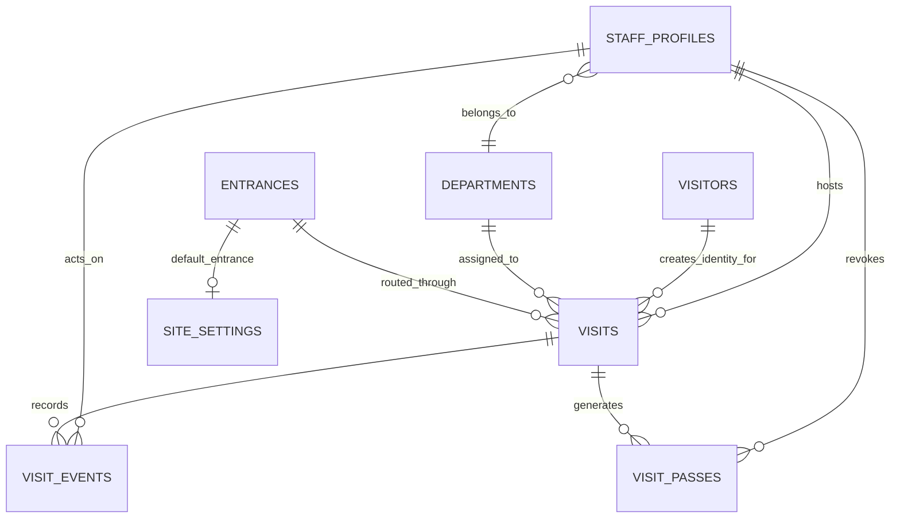

# CD-VMS

Cloud-based visitor management system for digital visitor registration, host approval, QR pass issuance, and admin/security monitoring.

## Project Overview

CD-VMS is a visitor management platform built for offices, campuses, coworking spaces, and other controlled-entry facilities. It replaces manual reception logs and fragmented approval processes with a centralized, role-aware workflow powered by a React frontend and a Supabase backend.

The platform supports:

- Public visitor registration
- Host and department selection
- Pending approval workflow
- QR-based digital visitor passes after approval
- Host workspace for reviewing and managing assigned visits
- Admin/security workspace for logs, staff, departments, reporting, and settings
- Event logging for visit history and operational visibility

The system is designed to keep the visitor experience simple while giving hosts and security teams the visibility they need before, during, and after arrival.

## Problem Statement

Many organizations still rely on paper sign-in sheets, ad hoc spreadsheets, or disconnected reception workflows. That creates several operational and security problems:

- Visitors can arrive before the correct host has reviewed the request
- Reception teams may not know whether a visitor is approved, pending, or rejected
- Paper-based records make compliance review and historical lookup difficult
- Security teams lack a live view of who is expected, who is on-site, and who has already left
- Staff onboarding for visitor workflows becomes inconsistent when there is no central portal

CD-VMS solves these problems by giving visitors, hosts, and admins a single digital workflow with structured approvals, pass issuance, status tracking, and audit history.

## Main Users And Authority Hierarchy

### Admin

Highest authority in the system.

Main use cases:

- View and manage all visitor logs
- Inspect visit details and lifecycle events
- Approve or reject visits
- Check visitors in and out
- Invite staff into the platform
- Review department coverage
- Review reporting summaries
- Update operational settings

### Host

Scoped operational authority.

Main use cases:

- View assigned visitors
- Review pending visit requests
- Approve or reject assigned visits
- Check approved visitors in
- Check checked-in visitors out
- Review visit history
- Update own profile and notification preferences

### Visitor

Public, anonymous user.

Main use cases:

- Open the public portal
- Submit a visit request
- Provide personal and visit details
- Wait for host approval
- View a tokenized QR/digital pass if a pass has been issued
- Present the pass at reception/security

### Authority Diagram

```text
Admin / Security
    ├── full operational oversight
    ├── all visit logs
    ├── staff directory + invites
    ├── departments + settings
    └── report/export access

Host
    ├── own assigned visits only
    ├── approve / reject own pending requests
    ├── check in / check out own approved visitors
    └── own profile + preferences

Visitor
    ├── public registration only
    └── pass viewing through secure token link
```

## Portal / Application Hierarchy

```text
CD-VMS Portal
├── Public Area
│   ├── /                  Home
│   ├── /register          Visitor Registration
│   └── /pass?token=...    QR / Digital Pass
├── Auth Area
│   ├── /login             Staff Login
│   ├── /forgot-password   Forgot Password
│   ├── /auth/callback     Supabase Auth Redirect Handler
│   └── /reset-password    Password Setup / Reset
├── Host Area
│   ├── /host                      Dashboard Overview
│   ├── /host?view=visitors        My Visitors
│   ├── /host?view=pending         Pending Requests
│   ├── /host?view=history         Visit History
│   └── /host?view=profile         Profile
└── Admin Area
    ├── /admin                     Dashboard Overview
    ├── /admin?view=logs           Visitor Logs
    ├── /admin?view=staff          Staff Management
    ├── /admin?view=departments    Departments
    ├── /admin?view=reports        Reports
    └── /admin?view=settings       Settings
```

## Core Features

### Public Features

- Marketing/overview landing page
- Visitor registration form
- Live host directory lookup from Supabase
- Live department lookup from Supabase
- Visit request submission into the backend
- Pending-submission confirmation dialog
- Tokenized QR pass viewer page

### Host Features

- Host overview dashboard
- Assigned visitor list with search and pagination
- Pending approval queue
- Visit history list with search and pagination
- Approve and reject workflow
- Check-in and check-out workflow
- Visitor detail drawer with event timeline
- Profile and notification preferences

### Admin / Security Features

- Admin overview dashboard
- Visitor logs with server-side search, filtering, and pagination
- Staff directory
- Invite-only staff onboarding
- Department coverage summaries
- Reporting summaries derived from backend RPCs
- Settings management
- Export visitor logs to CSV
- Export report summary to JSON

### Authentication Features

- Supabase Auth email/password sign-in
- Forgot-password flow using Supabase built-in recovery emails
- Auth callback route
- Reset password / invited-account activation route
- Logout from host and admin dashboards

### Logging / Audit Features

- Visit event logging
- Visit status transition history
- Pass issuance / pass-related lifecycle visibility
- Activity feed in host and admin dashboards

## Visitor Lifecycle

```text
Visitor opens portal
        ↓
Loads host + department options from Supabase
        ↓
Submits registration form
        ↓
Visit request is stored as pending
        ↓
Visit event is logged
        ↓
Host or admin reviews request
        ↓
Approved or rejected
        ↓
If approved, a pass can be issued / used
        ↓
Visitor is checked in
        ↓
Visit remains visible in logs and dashboards
        ↓
Visitor is checked out or visit later expires
```

## Authentication And Authorization

CD-VMS uses **Supabase Auth** for staff accounts only.

- Visitors do not create accounts
- Hosts and admins sign in with email/password
- Password recovery is handled by `supabase.auth.resetPasswordForEmail`
- Password updates are handled by `supabase.auth.updateUser`
- Staff onboarding uses Supabase invite emails through the `invite-staff` Edge Function

Important implementation detail:

- The login screen includes a host/admin tab selector for UX clarity
- Actual authorization is **not** determined by that tab
- Real access control comes from `staff_profiles.permission_role`

### Role Rules

- `admin`: highest authority, full operational access
- `host`: scoped to own assigned visits and own profile
- `visitor`: public access only; no staff dashboard access

### Route Protection

Protected routes are implemented with [`ProtectedRoute`](src/components/auth/ProtectedRoute.tsx).

- `/host` allows `host` and `admin`
- `/admin` allows `admin` only
- Unauthenticated users are redirected to `/login`
- Authenticated users without permission are redirected to the correct dashboard

## Frontend Architecture

### Stack

- React 18
- TypeScript
- Vite
- React Router
- Tailwind CSS
- Radix UI primitives
- Supabase JavaScript client

### Frontend Structure

```text
Frontend
├── Pages / Routes
│   ├── public pages
│   ├── auth pages
│   ├── host dashboard page
│   └── admin dashboard page
├── Components
│   ├── dashboard views
│   ├── layout components
│   └── shared UI primitives
├── Auth Context
│   └── session + profile bootstrap
├── Supabase Client
│   ├── typed client
│   └── backend service wrapper
└── Route Guards
    └── role-based protection
```

### Frontend Organization

- `src/pages/` contains route-level pages
- `src/components/dashboard/` contains dashboard content, cards, feeds, drawer, and QR UI
- `src/components/layout/` contains the public navbar and dashboard shell
- `src/components/auth/` contains session/bootstrap and route protection
- `src/lib/supabase.ts` initializes the typed Supabase client
- `src/lib/cd-vms.ts` contains the backend-facing service layer and app-level types
- `src/lib/database.types.ts` contains generated Supabase database types

### State Management

The app uses local React state and a small auth context rather than a global state library.

- `AuthProvider` manages session, user, and current staff profile
- Page controllers manage dashboard-level state such as pagination, filters, selected visit detail, and refresh behavior
- Toast notifications provide UX feedback for mutations and auth flows

### Public vs Staff Separation

- Public pages are accessible without authentication
- Staff pages are protected by `ProtectedRoute`
- Dashboard controllers call Supabase RPCs and Edge Functions through `src/lib/cd-vms.ts`

## Backend / Supabase Architecture

The backend is built entirely on Supabase services:

- **Supabase Postgres** for application data
- **Supabase Auth** for staff authentication
- **Supabase built-in auth emails** for invite and password recovery flows
- **Row Level Security (RLS)** on all core operational tables
- **RPC functions** for filtered queries, summaries, pass lookup, and workflow mutations
- **Edge Functions** for invite-only staff onboarding and export generation

### Supabase Services Used

| Service | Used In Project | Notes |
|---|---|---|
| Postgres Database | Yes | Core application data |
| Supabase Auth | Yes | Staff login, reset, invite activation |
| Auth Emails | Yes | Invite and password reset |
| Edge Functions | Yes | Staff invite and exports |
| Storage | No | No file bucket workflow implemented |
| Realtime | No | Not currently used |

### Implemented RPC / Database Function Layer

The project relies on backend-shaped database functions instead of large client-side data joins.

Key functions include:

- `submit_visit_request`
- `get_public_pass`
- `decide_visit_request`
- `check_in_visit`
- `check_out_visit`
- `list_public_hosts`
- `list_host_visits`
- `get_host_dashboard_summary`
- `list_admin_visitor_logs`
- `get_admin_report_summary`
- `list_department_coverage`
- `list_staff_directory`
- `get_visit_detail`
- `list_recent_visit_activity`

### Edge Functions

Local function sources in `supabase/functions/`:

- `invite-staff`: active product function for admin-only staff invites
- `export-operations`: active product function for admin-only exports
- `create-staff-account`: intentionally disabled bootstrap function
- `repair-seeded-staff`: intentionally disabled bootstrap function

## Database Schema

The deployed Supabase project currently uses the following application tables.

### `departments`

Purpose:
Stores destination departments used by staff profiles and visit requests.

Key columns:

| Column | Type | Purpose |
|---|---|---|
| `id` | `uuid` | Primary key |
| `name` | `text` | Department name |
| `floor_label` | `text` | Human-readable location/floor |
| `is_active` | `boolean` | Whether the department is available in the UI |
| `created_at` | `timestamptz` | Audit timestamp |
| `updated_at` | `timestamptz` | Audit timestamp |

Relationships:

- Referenced by `staff_profiles.department_id`
- Referenced by `visits.department_id`

Used by:

- Visitor registration
- Staff profiles
- Admin department coverage

### `entrances`

Purpose:
Stores campus/building entrance points used for visit routing and reporting.

Key columns:

| Column | Type | Purpose |
|---|---|---|
| `id` | `uuid` | Primary key |
| `name` | `text` | Entrance name |
| `description` | `text` | Optional entrance description |
| `is_active` | `boolean` | Whether the entrance is available |
| `created_at` | `timestamptz` | Audit timestamp |
| `updated_at` | `timestamptz` | Audit timestamp |

Relationships:

- Referenced by `visits.entrance_id`
- Referenced by `site_settings.default_entrance_id`

Used by:

- Admin settings
- Pass display
- Reporting summaries

### `staff_profiles`

Purpose:
Stores application-level staff metadata linked to Supabase Auth users.

Key columns:

| Column | Type | Purpose |
|---|---|---|
| `id` | `uuid` | Primary key, linked to `auth.users.id` |
| `full_name` | `text` | Staff name |
| `work_email` | `text` | Staff email |
| `permission_role` | `text` | `host` or `admin` |
| `job_title` | `text` | UI/display title |
| `department_id` | `uuid` | Department assignment |
| `desk_location` | `text` | Host location |
| `account_status` | `text` | `invited`, `active`, `limited`, `disabled` |
| `availability_status` | `text` | `available`, `in_meeting`, `away` |
| `can_host_visits` | `boolean` | Whether the staff member can host visits |
| `notify_email_arrivals` | `boolean` | Host preference |
| `notify_sms_escalations` | `boolean` | Host preference |
| `notify_daily_digest` | `boolean` | Host preference |
| `reception_notes` | `text` | Host/reception notes |

Relationships:

- Belongs to `departments`
- Is the app-level extension of `auth.users`
- Referenced by `visits.host_staff_id`
- Referenced by `visits.decision_by`
- Referenced by `visit_events.actor_user_id`
- Referenced by `visit_passes.revoked_by`
- Referenced by `site_settings.updated_by`

Used by:

- Auth profile loading
- Protected routes
- Host profile page
- Staff management
- Visit ownership and decision tracking

### `site_settings`

Purpose:
Singleton settings row for admin-configurable visitor operations preferences.

Key columns:

| Column | Type | Purpose |
|---|---|---|
| `id` | `smallint` | Singleton primary key (`1`) |
| `log_retention_days` | `integer` | Configured retention window |
| `default_entrance_id` | `uuid` | Default entrance |
| `security_email_alerts` | `boolean` | Admin toggle |
| `badge_printing_enabled` | `boolean` | Admin toggle |
| `host_daily_digest_enabled` | `boolean` | Admin toggle |
| `updated_by` | `uuid` | Staff profile that last updated settings |

Relationships:

- References `entrances`
- References `staff_profiles`

Used by:

- Admin settings view

### `visitors`

Purpose:
Stores persistent visitor identity across multiple visits.

Key columns:

| Column | Type | Purpose |
|---|---|---|
| `id` | `uuid` | Primary key |
| `full_name` | `text` | Visitor name |
| `email` | `text` | Visitor email |
| `phone` | `text` | Visitor phone |
| `created_at` | `timestamptz` | Audit timestamp |
| `updated_at` | `timestamptz` | Audit timestamp |

Relationships:

- Parent of `visits.visitor_id`

Used by:

- Registration flow
- Visitor logs
- Visit detail and pass display

### `visits`

Purpose:
Core visit lifecycle record.

Key columns:

| Column | Type | Purpose |
|---|---|---|
| `id` | `uuid` | Primary key |
| `reference_code` | `text` | Human-friendly visit reference |
| `visitor_id` | `uuid` | Linked visitor |
| `visitor_organization` | `text` | Organization/company |
| `purpose` | `text` | Visit purpose |
| `host_staff_id` | `uuid` | Assigned host |
| `department_id` | `uuid` | Destination department |
| `entrance_id` | `uuid` | Assigned entrance |
| `scheduled_for` | `timestamptz` | Scheduled visit time |
| `status` | `text` | `pending`, `approved`, `rejected`, `checked_in`, `checked_out`, `expired` |
| `risk_level` | `text` | `low`, `medium`, `elevated` |
| `notes` | `text` | Optional visitor/admin notes |
| `privacy_consent_accepted_at` | `timestamptz` | Consent timestamp |
| `decision_at` | `timestamptz` | Approval/rejection time |
| `decision_by` | `uuid` | Staff actor for decision |
| `check_in_at` | `timestamptz` | Check-in time |
| `check_out_at` | `timestamptz` | Check-out time |

Relationships:

- Belongs to `visitors`
- Belongs to `staff_profiles` as host
- Belongs to `departments`
- Optionally belongs to `entrances`
- Parent of `visit_passes`
- Parent of `visit_events`

Used by:

- Registration
- Host dashboard
- Admin logs
- Pass flow
- Reporting

### `visit_passes`

Purpose:
Stores QR/digital pass lifecycle separate from the visit lifecycle.

Key columns:

| Column | Type | Purpose |
|---|---|---|
| `id` | `uuid` | Primary key |
| `visit_id` | `uuid` | Linked visit |
| `token` | `uuid` | Public pass token |
| `status` | `text` | `active`, `revoked`, `expired` |
| `issued_at` | `timestamptz` | Pass issue time |
| `expires_at` | `timestamptz` | Pass expiry |
| `revoked_at` | `timestamptz` | Revocation time |
| `revoked_by` | `uuid` | Revoking staff member |
| `revocation_reason` | `text` | Optional reason |

Relationships:

- Belongs to `visits`
- Optionally references `staff_profiles`

Used by:

- Public pass lookup
- Host/admin visit detail
- QR pass page

### `visit_events`

Purpose:
Stores event timeline and audit history for a visit.

Key columns:

| Column | Type | Purpose |
|---|---|---|
| `id` | `uuid` | Primary key |
| `visit_id` | `uuid` | Linked visit |
| `event_type` | `text` | Machine-readable event type |
| `title` | `text` | Human-readable event title |
| `detail` | `text` | Optional event detail |
| `actor_user_id` | `uuid` | Staff actor |
| `actor_label` | `text` | Human-readable actor label |
| `is_internal` | `boolean` | Internal visibility flag |
| `occurred_at` | `timestamptz` | Event timestamp |

Relationships:

- Belongs to `visits`
- Optionally references `staff_profiles`

Used by:

- Visitor detail drawer
- Activity feeds
- Audit history

## Database Relationship Diagram



## Backend Relationship Explanation

- Every authenticated staff user has a corresponding `staff_profiles` record.
- `staff_profiles.id` matches `auth.users.id`, which links Supabase Auth to application-level role and department data.
- Visitors do not authenticate. Instead, their identity is stored in `visitors`.
- A single visitor can have multiple visits over time through `visits.visitor_id`.
- Each visit belongs to one host through `visits.host_staff_id`.
- Each visit belongs to one department and may belong to one entrance.
- Timeline history is tracked separately in `visit_events`, which keeps the main `visits` row focused on current lifecycle state.
- QR/pass information is stored in `visit_passes`, allowing pass lifecycle to be managed separately from the visit lifecycle.
- Settings are stored in a singleton `site_settings` table rather than a generic key/value system.

## Main Data Flows

### Visitor Registration Flow

Frontend trigger:

- Visitor submits `/register`

Backend operation:

- `fetchRegistrationOptions()` loads `departments` plus `list_public_hosts()`
- `submitVisitRequest()` calls `submit_visit_request`

Tables touched:

- `visitors`
- `visits`
- `visit_events`

Final UI result:

- Success dialog shows pending status and reference code

### Host Approval Flow

Frontend trigger:

- Host approves or rejects from pending queue or detail drawer

Backend operation:

- `decideVisit()` calls `decide_visit_request`

Tables touched:

- `visits`
- `visit_events`
- potentially `visit_passes`

Final UI result:

- Visit status updates
- Host dashboard refreshes
- Detail timeline updates

### QR Pass Flow

Frontend trigger:

- Public user opens `/pass?token=...`

Backend operation:

- `fetchPublicPass()` calls `get_public_pass`

Tables touched:

- `visit_passes`
- `visits`
- `visitors`
- `staff_profiles`
- `departments`
- `entrances`

Final UI result:

- Real QR/digital pass is rendered if the token resolves to an active pass

### Admin Staff Management Flow

Frontend trigger:

- Admin submits the add-staff modal

Backend operation:

- `inviteStaffMember()` calls the `invite-staff` Edge Function
- The function validates the caller is an admin
- Supabase Auth sends an invite email
- The matching `staff_profiles` record is updated

Tables touched:

- `staff_profiles`
- `auth.users`

Final UI result:

- Staff invite is sent
- Staff directory refreshes

### Forgot Password Flow

Frontend trigger:

- User submits `/forgot-password`

Backend operation:

- `supabase.auth.resetPasswordForEmail(...)`
- Redirect target goes to `/auth/callback?next=/reset-password`

Tables touched:

- Supabase Auth only

Final UI result:

- User receives Supabase recovery email
- User lands on password reset screen

### Reporting / Logs Flow

Frontend trigger:

- Admin opens overview, logs, reports, or export

Backend operation:

- Logs use `list_admin_visitor_logs`
- Reports use `get_admin_report_summary`
- Activity feed uses `list_recent_visit_activity`
- Export uses `export-operations`

Tables touched:

- `visits`
- `visit_events`
- `visit_passes`
- `staff_profiles`
- `departments`
- `entrances`

Final UI result:

- Admin sees filtered log pages, dashboard summaries, and downloadable exports

## Security Model

### Public Access Boundaries

Public users can:

- View the landing page
- View active departments
- View public host options through `list_public_hosts`
- Submit a visitor registration request
- View a pass only through a secure pass token

Public users cannot:

- Read raw visit logs
- Read staff profiles directly
- Read dashboard data

### Authenticated Staff Access

Staff access is restricted by Supabase Auth session plus role-aware profile lookup.

### Admin Permissions

Admins can:

- Read all visits through admin RPCs
- Manage staff invites
- Read and update settings
- Read department coverage and reports
- Export data

### Host Permissions

Hosts can:

- Read their own assigned visits
- Approve/reject their own pending visits
- Check in and check out their assigned visitors
- Update their own profile preferences

### RLS Model

RLS is enabled on all major public tables.

Implemented policy patterns include:

- Anonymous read access only for active departments and entrances
- Authenticated read access for departments and entrances
- Staff self/admin read/update access for profiles
- Staff scoped read access for visits, visitors, visit passes, and visit events
- Admin-only write access for departments, entrances, and settings

The project also relies on security-definer RPCs for role-aware querying and workflow mutations.

### Pass Token Security

- Public pass access is token-based, not table-based
- `/pass` requires a token
- Pass lookup uses `get_public_pass`
- The QR pass page does not expose raw database rows directly

## Project Setup

### Prerequisites

- Node.js 18+ recommended
- npm
- A Supabase project

### Install Dependencies

```bash
npm install
```

### Environment Variables

Create a local `.env` file:

```env
VITE_SUPABASE_URL=
VITE_SUPABASE_PUBLISHABLE_KEY=
```

Notes:

- The repository currently includes `.env.example`
- For a new deployment, replace those values with your own Supabase project values

### Supabase Setup

This project expects a Supabase backend with:

- the tables listed in this README
- the RPC functions used by `src/lib/cd-vms.ts`
- RLS policies enabled
- Auth configured with:
  - Site URL: `https://cd-vms.vercel.app`
  - Redirect URL: `https://cd-vms.vercel.app/auth/callback`
- Edge Functions deployed:
  - `invite-staff`
  - `export-operations`
- Edge Function secrets configured:
  - `PUBLIC_APP_URL=https://cd-vms.vercel.app`

### Migrations

Current repository state:

- The repo includes the latest tracked migration file:
  - `supabase/migrations/20260523233000_cd_vms_dashboard_backend_completion.sql`
- The deployed Supabase project has additional applied migrations in its migration history

Important:

- The repository does **not** currently contain the full baseline migration chain needed to rebuild a blank project from scratch
- For this assignment, the intended setup is the provided Supabase project rather than a fully self-bootstrapable local Supabase stack

### Start The Development Server

```bash
npm run dev
```

### Build The Project

```bash
npm run build
```

### Preview Production Build

```bash
npm run preview
```

## Environment Variables

Actual frontend environment variables used by the codebase:

| Variable | Purpose |
|---|---|
| `VITE_SUPABASE_URL` | Supabase project URL |
| `VITE_SUPABASE_PUBLISHABLE_KEY` | Supabase publishable API key |

Supabase Edge Function environment variables:

| Variable | Purpose |
|---|---|
| `PUBLIC_APP_URL` | Canonical deployed app URL used for invite and auth email redirects |

## Folder Structure

```text
src/
├── assets/                Static assets
├── components/
│   ├── auth/              Auth provider and protected route
│   ├── dashboard/         Dashboard UI, cards, drawer, QR components
│   ├── layout/            Navbar, dashboard shell, branding
│   └── ui/                Reusable UI primitives
├── data/                  Legacy mock/reference data
├── lib/
│   ├── cd-vms.ts          Backend service layer and app types
│   ├── database.types.ts  Generated Supabase types
│   ├── supabase.ts        Supabase client setup
│   └── utils.ts           Shared utilities
├── pages/                 Route pages
├── App.tsx                Route map
└── main.tsx               App bootstrap

supabase/
├── functions/
│   ├── invite-staff/
│   ├── export-operations/
│   ├── create-staff-account/   disabled bootstrap function
│   └── repair-seeded-staff/    disabled bootstrap function
└── migrations/
    └── 20260523233000_cd_vms_dashboard_backend_completion.sql
```

## Important Design Decisions

### Why Supabase?

Supabase was selected because it provides:

- Postgres database
- authentication
- auth emails
- Row Level Security
- RPC support
- Edge Functions

That makes it a strong fit for an assignment-scale full-stack system without needing a separate custom backend server.

### Why Use Supabase Auth Emails?

The project intentionally uses Supabase built-in auth flows instead of custom SMTP providers because:

- it keeps implementation smaller
- it aligns with the assignment scope
- it avoids extra infrastructure such as SendGrid or Resend

### Why Keep Visitors Anonymous?

Visitors only need to submit visit requests and present passes. They do not need long-lived accounts or a staff portal, so keeping them anonymous reduces friction.

### Why Separate Hosts And Admins?

Hosts should only manage visits relevant to them, while admins/security need broader visibility and operational control. The role split keeps permissions tighter and the UI clearer.

### Why Separate `visit_events` From `visits`?

The main `visits` row represents current state. `visit_events` keeps the historical timeline and audit trail without overloading the core visit record.

### Why Separate `visit_passes` From `visits`?

Pass lifecycle is different from visit lifecycle. A visit may be approved, checked in, checked out, or rejected, while passes can be issued, revoked, expired, or rotated independently.

### Why No Supabase Storage?

The current product does not upload files, avatars, or visitor documents. QR codes are generated client-side, so a storage bucket is unnecessary in the implemented scope.

## Limitations / Future Improvements

Honest current limitations:

- The repo does not yet include the full historical migration chain required to recreate the deployed backend from a blank Supabase project
- Supabase built-in email delivery is acceptable for assignment/demo scope but would likely need a production SMTP strategy later
- No CAPTCHA or abuse protection is currently applied to the public registration form
- No realtime notifications are implemented
- Reporting is query-derived and lightweight; advanced analytics could be added later
- The QR pass experience supports browser print/download, but a richer printable badge workflow could be added
- Multi-organization / multi-tenant support is not implemented
- Bootstrap-only Edge Functions still exist in disabled form and should be removed entirely in a hardened production deployment
- `src/data/mockData.ts` remains in the repository as legacy reference material, but core business flows no longer depend on it

## Final Summary

CD-VMS delivers a complete visitor operations workflow with a modern frontend and a Supabase backend. Visitors can register digitally, hosts can review and manage their assigned requests, admins can monitor system-wide activity, and the platform keeps visit history, pass access, and operational settings in one place.

In its current implemented state, the project includes:

- public visitor registration
- host and admin role-based dashboards
- Supabase Auth staff access
- QR/digital pass flow
- server-backed logs, reports, and exports
- event-based visit history
- a normalized Supabase data model with RLS

This makes CD-VMS suitable as a strong academic submission and a credible foundation for a real-world visitor management platform.
